# Laporan Modul 7: Polymorphism
**Mata Kuliah:** Praktikum Pemrograman Berorientasi Objek  
**Nama:** Riski Al Fatah  
**NIM:** 2024573010036  
**Kelas:** TI.2E

---

## Abstrak
Praktikum ini bertujuan untuk mempelajari dan mengimplementasikan konsep Polimorfisme (Polymorphism) dalam Pemrograman Berorientasi Objek (PBO) menggunakan bahasa pemrograman Java. Polimorfisme merupakan pilar penting dalam PBO yang memungkinkan satu antarmuka (interface) digunakan untuk memerintah berbagai bentuk objek yang berbeda. Dalam praktikum ini, dua jenis utama polimorfisme diuji coba: Compile-time Polymorphism (Static) melalui mekanisme Method Overloading dan Runtime Polymorphism (Dynamic) melalui mekanisme Method Overriding dan pewarisan (Inheritance).

Studi kasus pertama menggunakan kelas Calculator untuk mendemonstrasikan bagaimana satu nama method (add) dapat menangani berbagai tipe data input dan jumlah parameter yang berbeda. Studi kasus kedua menggunakan hierarki kelas Shape (Induk) dengan turunan Circle, Rectangle, dan Triangle untuk mendemonstrasikan bagaimana objek-objek berbeda dapat merespons perintah yang sama (draw dan calculateArea) dengan perilaku yang spesifik. Hasil praktikum menunjukkan bahwa penerapan polimorfisme dapat meningkatkan fleksibilitas kode, keterbacaan, dan efisiensi melalui penggunaan polymorphic arguments dan dynamic method dispatch.

---

## Pendahuluan
Dalam konteks pemrograman OOP (Object Oriented Programming), istilah polymorphism sering digunakan karena berkaitan erat dengan salah satu pilar seperti class, object, method, atau inheritance. Polymorphism adalah banyak bentuk atau bermacam-macam. Dalam istilah pemrograman, polymorphism adalah sebuah konsep di mana sebuah interface tunggal digunakan pada entitas yang berbeda-beda. Umumnya, penggunaan suatu simbol tunggal berfungsi untuk mewakili beberapa jenis tipe entitas.

Polymorphism adalah konsep pemrograman yang berorientasi pada objek yang mengacu pada kemampuan variabel, fungsi atau objek untuk mengambil beberapa bentuk. Polymorphism adalah penggunaan salah satu item seperti fungsi, atribut, atau interface pada berbagai jenis objek yang berbeda dalam bahasa pemrograman. Dalam bahasa pemrograman yang menunjukkan polimorfisme, objek kelas miliki hierarki yang sama yang diwariskan dari kelas induk yang sama, mungkin memiliki fungsi dengan nama yang sama, tetapi dengan perilaku berbeda.
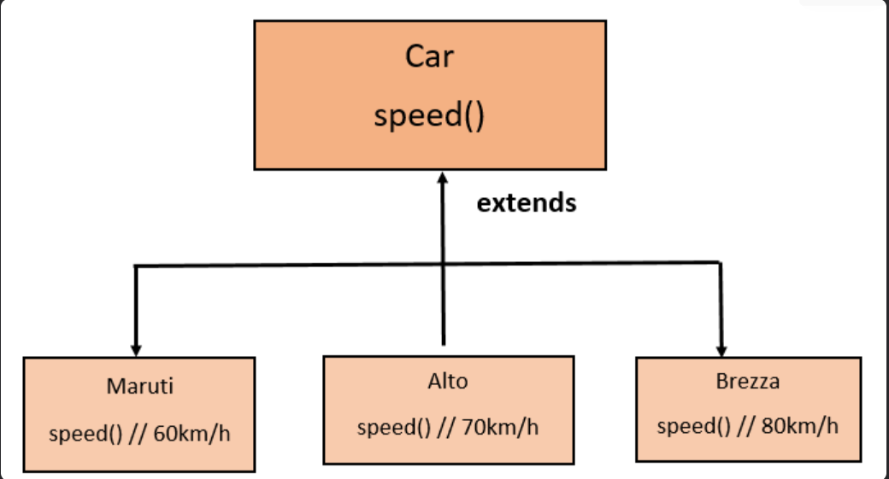

---
#### Tujuan Polymorphism
1. Flexibility - Memungkinkan kode yang lebih fleksibel dan mudah diperluas.
2. Code Reusability - Mengurangi duplikasi kode dengan menggunakan interface yang sama.
3. Maintainability - Memudahkan maintenance dan pengembangan fitur baru.
3. Dynamic Behavior - Perilaku objek ditentukan pada runtime
4. Interface Consistency - Konsistensi dalam penggunaan interface

#### Cara Implementasi

1. Gunakan inheritance hierarchy
2. Override method di subclass
3. Gunakan reference superclass untuk memegang objek subclass
4. Method yang dipanggil ditentukan pada runtime berdasarkan tipe aktual objek

#### Jenis-jenis Polimorfisme:
#### Compile-time Polymorphism (Method Overloading)
Method overriding terjadi ketika subclass (class anak) menyediakan implementasi spesifik untuk method yang sudah didefinisikan di superclass (class induk). Method overriding digunakan untuk mengubah atau memperluas perilaku method yang diwarisi dari superclass. Method yang di-override harus memiliki nama, parameter, dan return type yang sama dengan method di superclass.

#### Aturan Method Overriding:
+ Method harus memiliki nama dan parameter yang sama dengan method di superclass.
+ Return type harus sama atau subtype dari return type di superclass.
+ Access modifier tidak boleh lebih restriktif daripada method di superclass (misalnya, jika method di superclass protected, method di subclass bisa protected atau public).
+ Method tidak bisa di-override jika di superclass dideklarasikan sebagai final.
#### Runtime Polymorphism (Method Overriding)
Method overriding terjadi ketika subclass (class anak) menyediakan implementasi spesifik untuk method yang sudah didefinisikan di superclass (class induk). Method overriding digunakan untuk mengubah atau memperluas perilaku method yang diwarisi dari superclass. Method yang di-override harus memiliki nama, parameter, dan return type yang sama dengan method di superclass.

#### Aturan Method Overriding:
+ Method harus memiliki nama dan parameter yang sama dengan method di superclass.
+ Return type harus sama atau subtype dari return type di superclass.
+ Access modifier tidak boleh lebih restriktif daripada method di superclass (misalnya, jika method di superclass protected, method di subclass bisa protected atau public).
+ Method tidak bisa di-override jika di superclass dideklarasikan sebagai final.

---

### Praktikum 1: Memahami Method Overloading (Compile-time Polymorphism)

**Contoh Code Method Overloading:** 
**Class Calculator**
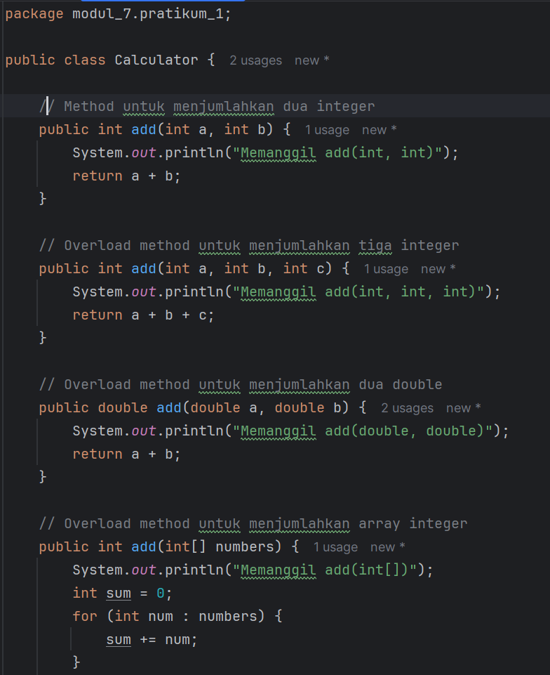
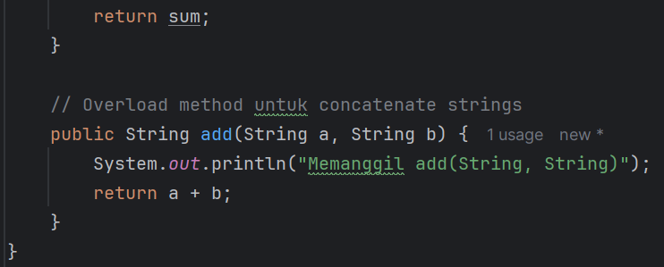

**Class OverloadingTest**
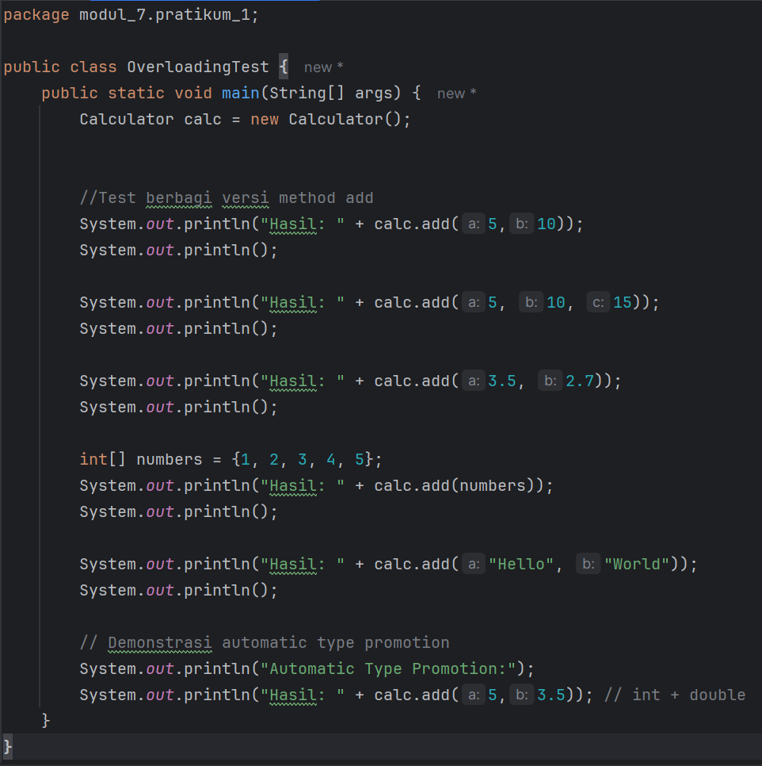
**OutPut:**
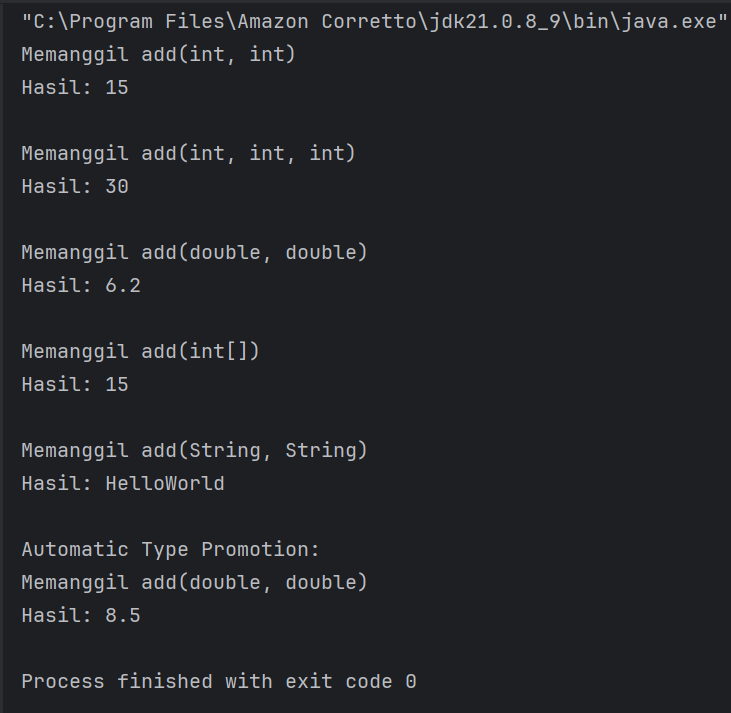

**Analisa:**
1. Konsep Utama: Method Overloading
   Kode ini mendemonstrasikan Static Polymorphism (Polimorfisme Statis) atau yang lebih dikenal sebagai Method Overloading.

Definisi: Membuat beberapa method dengan nama yang sama (add) di dalam class yang sama, tetapi dengan parameter yang berbeda (baik jumlah parameter, tipe data, atau urutan tipe data).

Tujuan: Memudahkan penggunaan method sehingga programmer tidak perlu mengingat banyak nama method yang berbeda (seperti addInt, addDouble, addString) untuk operasi yang serupa.

2. Analisis Class Calculator
   Class ini mendefinisikan 5 versi dari method add. Berikut rinciannya:

add(int a, int b): Menerima 2 integer. Ini adalah bentuk penjumlahan dasar.

add(int a, int b, int c): Menerima 3 integer. Ini menunjukkan overloading berdasarkan jumlah parameter.

add(double a, double b): Menerima 2 double. Ini menunjukkan overloading berdasarkan tipe data.

add(int[] numbers): Menerima array integer. Ini menangani kumpulan data.

Catatan: Method ini melakukan iterasi (for-each loop) untuk menjumlahkan seluruh elemen array.

add(String a, String b): Menerima 2 String.

Perbedaan Logika: Di sini operator + tidak menjumlahkan angka, melainkan melakukan konkatenasi (penggabungan) string. Overloading memungkinkan perubahan perilaku (behavior) tergantung inputnya.

3. Analisis Class OverloadingTest & Automatic Type Promotion
   Bagian paling menarik dari kode ini ada di baris terakhir main method. Mari kita bedah satu per satu eksekusinya:

Case 1-5 (Standard Overloading): Pemanggilan method seperti calc.add(5, 10) atau calc.add("Hello", "World") sangat jelas (explicit). Java akan mencocokkan tipe data input secara langsung dengan parameter method yang tersedia.

Case 6 (Automatic Type Promotion):

System.out.println("Hasil: " + calc.add(5, 3.5)); // int + double
Di sini kamu memasukkan satu int (5) dan satu double (3.5).

Java mencari method add(int, double). Tidak ditemukan.

Java melakukan Type Promotion (Widening Casting). Tipe data yang lebih kecil (int) akan otomatis diubah ke tipe yang lebih besar (double) agar sesuai dengan method yang tersedia.

Angka 5 dipromosikan menjadi 5.0.

Maka, method yang dipanggil adalah add(double a, double b).

4. Prediksi Output Program
   Jika kode ini dijalankan, berikut adalah hasil yang akan tampil di konsol:

Memanggil add(int, int)
Hasil: 15

Memanggil add(int, int, int)
Hasil: 30

Memanggil add(double, double)
Hasil: 6.2

Memanggil add(int[])
Hasil: 15

Memanggil add(String, String)
Hasil: HelloWorld

Automatic Type Promotion:
Memanggil add(double, double)
Hasil: 8.5
5. Kesimpulan & Saran Perbaikan
   Kode ini sudah sangat baik untuk tujuan pembelajaran modul praktikum. Struktur kodenya rapi dan mencakup berbagai skenario overloading.

Saran Kecil (Opsional): Pada method penjumlahan array:

public int add(int[] numbers)

Kamu bisa mengubahnya menggunakan fitur Varargs (Variable Arguments) agar lebih fleksibel:

public int add(int... numbers)

Jika menggunakan int..., kamu bisa memanggilnya dengan calc.add(1, 2, 3, 4) tanpa perlu membuat array new int[]{...} secara manual terlebih dahulu, namun tetap bisa menerima array.

### Praktikum 2: Memahami Method Overriding (Runtime Polymorphism)

#### Contoh Code Method Overriding dan Kata Kunci super:
Class Shape sebagai superclass:
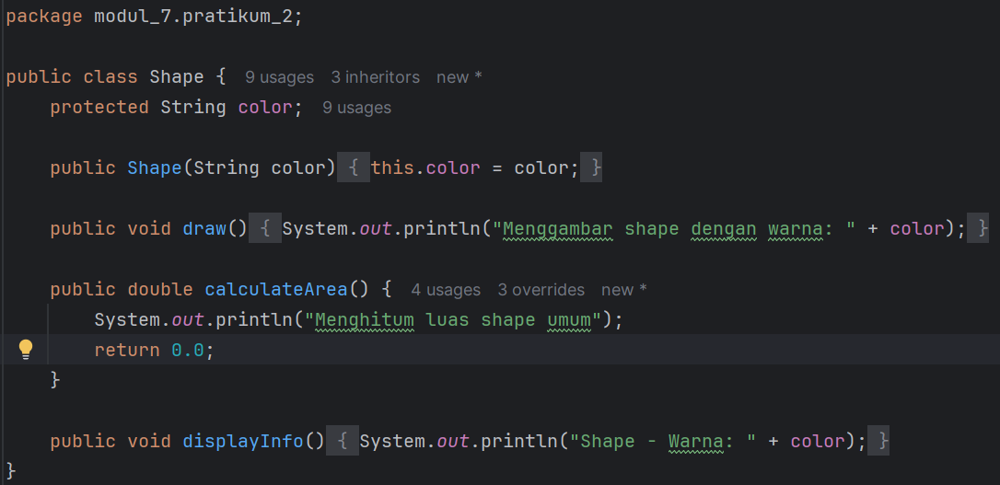
Class Circle yang mewarisi Shape:
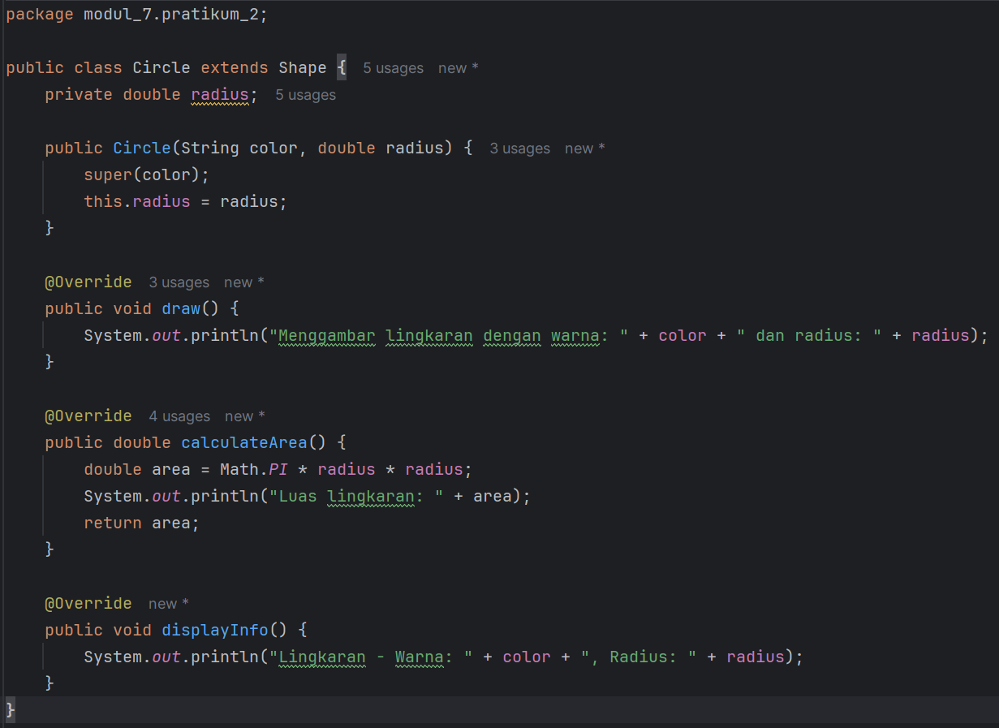
Class Rectangle yang mewarisi Shape:
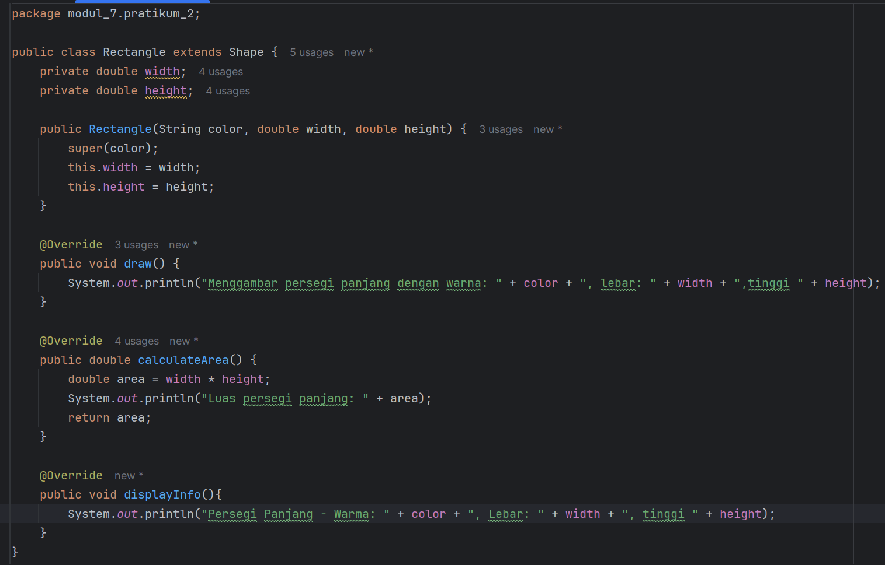
Class Triangle yang mewarisi Shape:
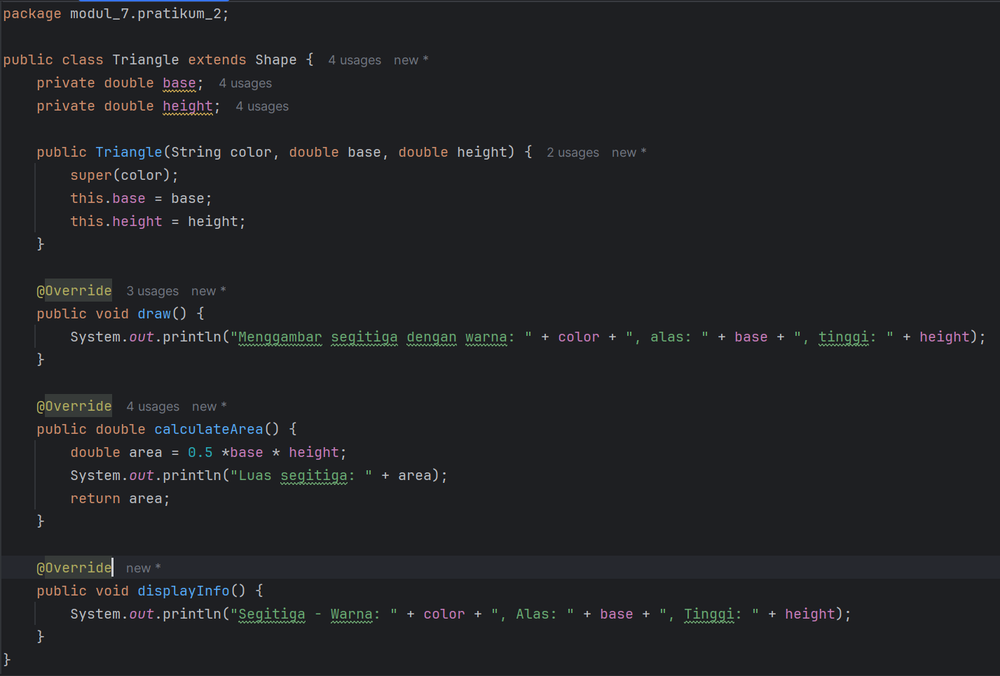
Class PolymorphismTest untuk testing:
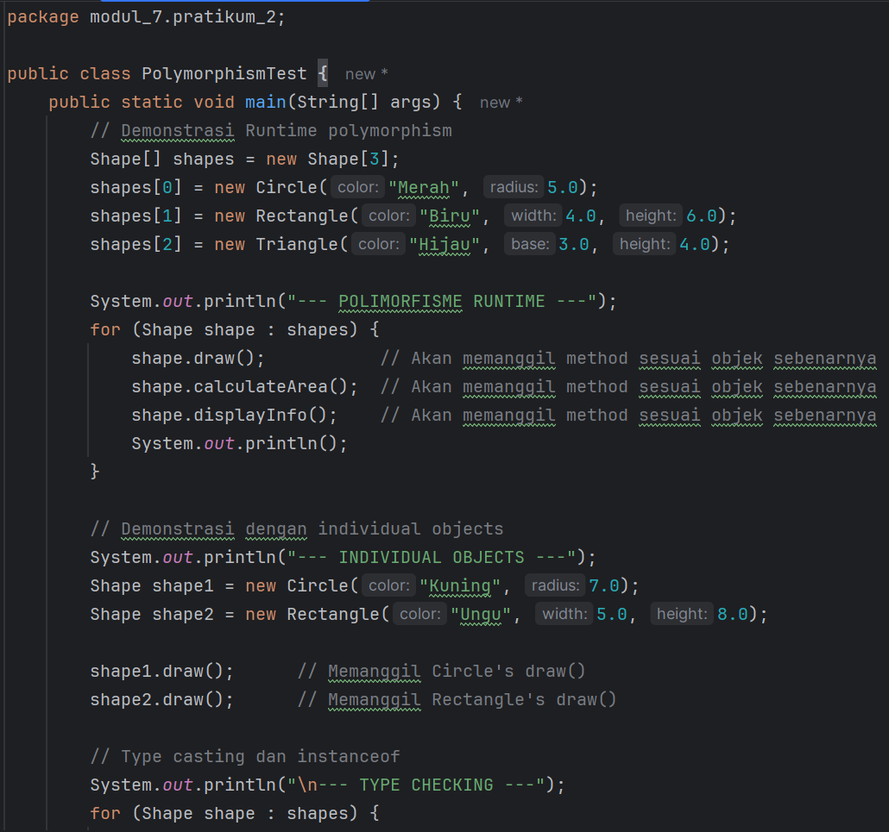
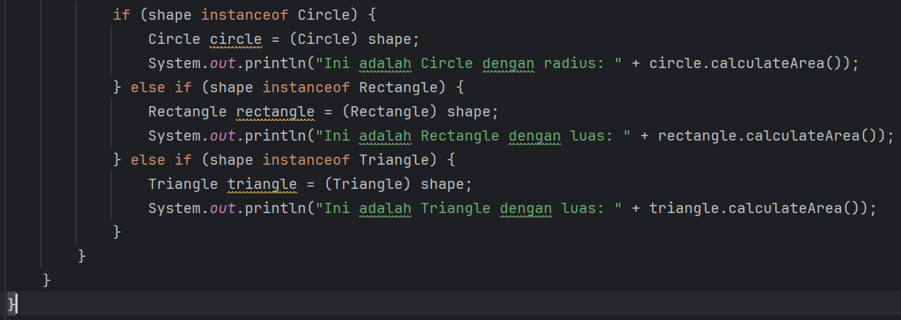

**OutPut:**
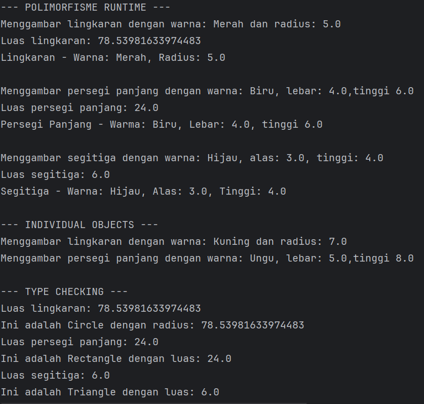
**Analisa:**
#### 1. Shape.java (Super Class / Induk)
Ini adalah kelas dasar yang menjadi kerangka bagi bentuk-bentuk lainnya.
+ protected String color: Penggunaan access modifier protected di sini sangat tepat. Ini memungkinkan variabel color diakses langsung oleh kelas turunannya (Circle, Rectangle, Triangle) tanpa perlu menggunakan getter/setter, namun tetap tertutup bagi kelas lain di luar package (kecuali turunan).
+ virtual behavior: Method calculateArea() mengembalikan 0.0 dan draw() hanya mencetak teks umum. Ini adalah perilaku default. Dalam implementasi dunia nyata, kelas ini seringkali dijadikan abstract class agar tidak bisa diinstansiasi secara langsung, karena "Shape" (bentuk) itu sendiri terlalu abstrak.

#### 2. Circle, Rectangle, Triangle (Sub Classes / Anak)
Ketiga kelas ini menerapkan konsep Inheritance (extends Shape) dan Overriding.
+ super(color): Di dalam constructor setiap kelas anak, terdapat pemanggilan super(color). Ini wajib dilakukan untuk mengirimkan data color ke constructor kelas induk (Shape) agar inisialisasi berjalan benar.
+ @Override: Anotasi ini memastikan bahwa method draw, calculateArea, dan displayInfo benar-benar menggantikan (menimpa) method milik Shape.

+ Logika Spesifik:
+ Circle: Menggunakan rumus $\pi \times r^2$.
+ Rectangle: Menggunakan rumus $p \times l$.
+ Triangle: Menggunakan rumus $0.5 \times a \times t$.

3. PolymorphismTest.java (Driver Class)Ini adalah inti dari materi modul ini. Ada 3 konsep penting yang didemonstrasikan di sini:

A. Polymorphic Array (Shape[] shapes)

Shape[] shapes = new Shape[3];
shapes[0] = new Circle(...);
shapes[1] = new Rectangle(...);
Ini adalah kekuatan utama polimorfisme. Kamu bisa membuat array bertipe Shape (Induk), tapi mengisinya dengan objek Circle, Rectangle, atau Triangle (Anak). Java menganggap semua objek ini "bersaudara" di bawah payung Shape.

B. Dynamic Method Dispatch (Looping)
for (Shape shape : shapes) {
shape.draw();
}

Saat baris shape.draw() dijalankan:
1. Java tidak melihat tipe variabelnya (Shape).
2. Java melihat objek aslinya yang ada di memori saat itu (apakah itu Circle, Rectangle, atau Triangle).
3. Jika objek aslinya adalah Circle, maka draw() milik Circle yang dipanggil. Ini terjadi secara otomatis saat program berjalan (Runtime).

#### C. Type Checking & Casting (instanceof)
if (shape instanceof Circle) {
Circle circle = (Circle) shape;
// ...
}

Bagian ini menunjukkan cara "mengembalikan" objek umum menjadi objek spesifik.

+ instanceof: Mengecek "Apakah shape ini aslinya adalah Circle?".
+ (Circle) shape: Melakukan Downcasting. Setelah di-cast, kamu bisa mengakses method unik yang mungkin hanya dimiliki Circle (misal jika ada method getDiameter() yang tidak ada di Shape).

#### Catatan & Koreksi Kecil (Typo)
Secara logika kode sudah benar dan akan berjalan (compile) dengan baik. Namun, ada beberapa kesalahan penulisan string (typo) yang perlu diperhatikan agar output lebih rapi:

1. Di Shape.java:
+ System.out.println("Menghitum luas shape umum"); $\rightarrow$ Seharusnya "Menghitung".

2. Di Rectangle.java:
+ System.out.println("Persegi Panjang - Warma: " + ... $\rightarrow$ Seharusnya "Warna".

3. Di PolymorphismTest.java:
+ Di dalam blok if (shape instanceof Circle), kamu memanggil circle.calculateArea() di dalam System.out.println. Karena calculateArea sendiri sudah melakukan System.out.println di dalamnya, nanti outputnya akan muncul double (dua baris untuk satu perhitungan).

Prediksi Output (Singkat)

Jika dijalankan, kode akan menghasilkan output seperti ini:

--- POLIMORFISME RUNTIME ---
Menggambar lingkaran dengan warna: Merah dan radius: 5.0
Luas lingkaran: 78.53981633974483
Lingkaran - Warna: Merah, Radius: 5.0

Menggambar persegi panjang dengan warna: Biru, lebar: 4.0,tinggi 6.0
Luas persegi panjang: 24.0
Persegi Panjang - Warma: Biru, Lebar: 4.0, tinggi 6.0

... (dan seterusnya untuk Triangle)

Kesimpulan: Kamu sudah berhasil menerapkan pewarisan dan polimorfisme dengan baik. Struktur kode pemisahan antara generalisasi (Shape) dan spesialisasi (Circle, dll) sudah jelas.

## Kesimpulan
Berdasarkan percobaan dan analisis kode yang telah dilakukan pada Modul 7 ini, dapat ditarik beberapa kesimpulan sebagai berikut:

1. Dua Jenis Polimorfisme: Dalam Java, polimorfisme terbagi menjadi dua kategori utama:

+ Static Polymorphism (Overloading): Terjadi saat kompilasi. Memungkinkan penggunaan nama method yang sama untuk operasi sejenis namun dengan parameter (tipe/jumlah) yang berbeda. Hal ini meningkatkan keterbacaan kode (contoh: method add pada class Calculator).

+ Dynamic Polymorphism (Overriding): Terjadi saat runtime. Memungkinkan kelas turunan (subclass) untuk mendefinisikan ulang perilaku method yang diwarisi dari kelas induk (superclass).

2. Fleksibilitas Objek: Polimorfisme memungkinkan kita memperlakukan objek dari kelas-kelas yang berbeda (seperti Circle, Rectangle, Triangle) sebagai objek dari kelas induknya (Shape). Hal ini sangat berguna dalam pengolahan data kolektif, seperti menyimpan berbagai bentuk objek dalam satu array bertipe Shape.

3. Reusability & Scalability: Dengan konsep ini, kode menjadi lebih mudah dikembangkan (scalable). Jika ingin menambahkan bentuk baru di masa depan, kita hanya perlu membuat kelas baru yang mewarisi Shape tanpa harus mengubah logika utama pada program (seperti pada looping draw di PolymorphismTest).

4. Mekanisme Java: Praktikum ini memperjelas fungsi kata kunci penting seperti super (untuk memanggil konstruktor/method induk), @Override (untuk memastikan method ditimpa dengan benar), dan operator instanceof (untuk memeriksa tipe asli objek sebelum melakukan downcasting).
## Referensi
1. Oracle. (2023). The Java™ Tutorials: Polymorphism. Diakses dari https://docs.oracle.com/javase/tutorial/java/IandI/polymorphism.html
2. W3Schools. Java Polymorphism. Diakses dari https://www.w3schools.com/java/java_polymorphism.asp